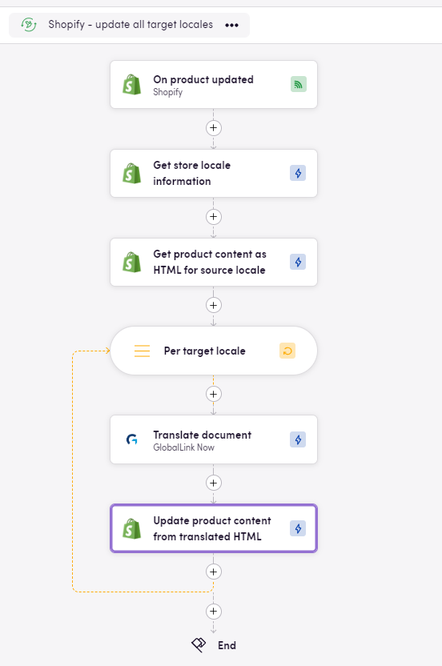

# Blackbird.io Shopify

Blackbird is the new automation backbone for the language technology industry. Blackbird provides enterprise-scale automation and orchestration with a simple no-code/low-code platform. Blackbird enables ambitious organizations to identify, vet and automate as many processes as possible. Not just localization workflows, but any business and IT process. This repository represents an application that is deployable on Blackbird and usable inside the workflow editor.

## Introduction

<!-- begin docs -->

Shopify is a cloud-based e-commerce platform that enables users to create, customize, and manage online stores. It provides a wide range of features and tools for businesses to sell products and services online, including website templates, payment processing, inventory management, and marketing tools. Shopify allows users to reach customers across different channels, including web, mobile, social media, and marketplaces, making it a versatile solution for individuals, entrepreneurs, and enterprises looking to establish and grow their online presence.

## Connecting

1. In Blackbird, navigate to 'Apps' and search for Shopify.
2. Click _Add Connection_.
3. Name your connection for future reference e.g. 'My Shopify connection'.
4. In Shopify, go to `Store settings -> Apps and sales channels -> Develop apps`.
5. Create the develop app.
6. Click `Configure Admin API scopes` to select the scopes you want to provide Blackbird with. Make sure to provide `read_locales` access scope. Other scopes that may be needed depending on desired actions are: `write_products`, `read_products`, `write_publications`, `read_publications`, `write_translations`, `read_translations`, `read_themes`, `read_content`.
7. After selecting the scopes click `Save` and go to `API credentials` and install the newly created app.
8. It will create the `Admin API access token` that you need to copy and paste it to the appropriate field in Blackbird.
9. Next in store settings click `Domains` and copy the name of the store from the domain and paste it to the appropriate field in Blackbird. F.E. if your domain is `mystore.myshopify.com`, you need to take `mystore`
10. Click _Connect_.
11. Confirm that the connection has appeared and the status is _Connected_. 

## Actions

### Store
- **Get store locales information** Get primary and other locales setup in the store
- **Get store resources content as HTML** returns content of all store resource type items in HTML format.
- **Update store resources content from HTML** updates content of all store resource type items from an HTML file.
- **Get store content as HTML** returns content of the store in HTML format. You should specify what resources you want to export: theme, menu, shop or shop policy.
- **Update store content from HTML** updates content of the store from an HTML file.

### Articles

- **List online store articles** List all articles in the online store
- **Get online store article translation as HTML** Get content of a specific online store article in HTML format
- **Update online store article content from HTML** Update content of a specific online store article from HTML file

### Blogs

- **List online store blogs** List all blogs in the online store
- **Get online store blog content as HTML** Get content of a specific online store blog in HTML format. You can also specify `Include articles` to True to export all blog post's articles as well.
- **Update online store blog content from HTML** Update content of a specific online store blog from HTML file

### Pages

- **List online store pages** List all pages in the online store
- **Get online store page content as HTML** Get content of a specific online store page in HTML format
- **Update online store page content from HTML** Update content of a specific online store page from HTML file

### Products

- **Search products** Search for products based on provided criteria
- **Get product content as HTML** Get content of a specific product in HTML format. You can also optionally specify more entities to export, f.e. metafields, options, option values.
- **Update product content from HTML** Update content of a specific product from HTML file

### Metafields

- **Get metafield content as HTML** returns product metafield contents in HTML format
- **Update metafield content from HTML** updates product metafield contents from the HTML file
- **Get metafield** returns metafield details of a specific product
- **Update metafield** updates metafield value of a specific product

### Themes

- **Get online store theme content as HTML** returns specific theme's contents in HTML format
- **Update online store theme content from HTML** updates specific theme's contents from the HTML file

### General

- **Update content from HTML** updates content of a specific content from HTML file. You can specify the content type manually by using optional input;

## Events

- **On product created**
- **On product deleted**
- **On product updated**
- **On product publications added**
- **On product publications deleted**
- **On locale created**
- **On locale updated**
- **On articles created**
- **On articles updated**
- **On pages created**
- **On pages updated**
- **On content created or updated** (for article and pages)

## Example

The following example shows how a bird can be setup so that anytime a Shopify product is updated, we get the locale setup of the online store, download the source content for the updated product as an HTML file, translate the file into all target locales using GlobalLink NOW MT solution and update all target products.

## Feedback

Do you want to use this app or do you have feedback on our implementation? Reach out to us using the [established channels](https://www.blackbird.io/) or create an issue.

<!-- end docs -->
